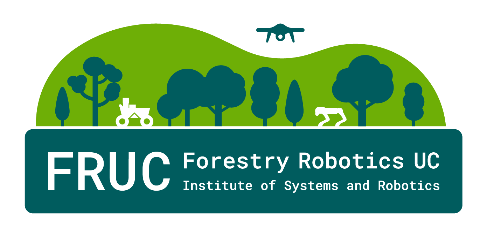

#   ENTFAC Sensor Fusion 

Stateless sensor fusion module for ENTFAC that turns single-frame semantic
perception outputs plus geometry into semantic point cloud measurements. Mapping
and temporal fusion live elsewhere.

## Attribution and Licensing

ENTFAC Sensor Fusion is a derivative work based on the open-source **Semantic SLAM**
implementation originally developed by **Xuan Zhang**, and later extended by
**David Russell**, particularly in the lidar-to-camera projection and semantic
point cloud generation components.

Original project:
https://github.com/floatlazer/semantic_slam

Significant modifications, refactoring, and architectural changes have been made
to support the ENTFAC modular sensor fusion framework, including ROS1 integration,
semantic fusion strategies, and system-level reorganization.

This project is distributed under the **GNU General Public License v3.0 (GPL-3.0)**.
See `LICENSE`.

## Responsibilities
- Input: semantic labels (+ optional confidence), depth image or LiDAR points,
  camera intrinsics, and frame transforms.
- Output: `SemanticPointCloud` in a target frame with per-point label and optional
  confidence. No map state is stored.
- Modes: depth-based fusion (RGB-D) and LiDAR projection fusion (LiDAR + camera).

## Repository Layout
- `entfac_fusion_core/`: catkin Python package; numpy-only, ROS-agnostic core.
  - Python sources live in `entfac_fusion_core/src/entfac_fusion_core/`.
- `entfac_fusion_ros/`: catkin ROS wrapper package.
  - `scripts/colored_pcl_node.py`: roslaunch entrypoint (thin wrapper).
  - `entfac_fusion_ros/src/entfac_fusion_ros/colored_pcl_node.py`: node implementation;
    bridges topics to the core and publishes `sensor_msgs/PointCloud2`.
  - `config/core.yaml`: core parameters (common defaults).
  - `config/expert.yaml`: advanced tuning (IMU/deskew/PLY/extrinsics).
  - Project overrides can be layered on top via launch files (site-specific topics/frames).
  - `launch/colored_pcl.launch`: generic launch (optional image_transport republish).
  - `launch/choupal_colored_pcl.launch`: Choupal bag demo (bag play + TF + republish).
- `tests/`: pytest coverage for core fusion paths.

## Core Usage (numpy)
```python
from entfac_fusion_core.colored_pcl import fuse_depth_semantics
from entfac_fusion_core.types import SemanticObservation, DepthObservation
import numpy as np

labels = np.zeros((480, 640), dtype=np.int32)
depth = np.ones((480, 640), dtype=float)
intrinsics = np.eye(3)
target_T_depth = np.eye(4)

pcl = fuse_depth_semantics(
    SemanticObservation(labels=labels),
    DepthObservation(depth=depth),
    intrinsics,
    target_T_depth,
)
# pcl.points_xyz, pcl.labels, pcl.confidence
```

## ROS Node (`colored_pcl_node.py`)
- Parameters:
  - `~semantic_topic`: semantic image (label IDs or RGB colors).
  - `~semantic_input_type`: `labels` (single-channel label IDs) or `rgb` (3-channel colors used directly for output coloring).
  - `~confidence_topic` (optional): confidence image aligned to semantic labels.
  - camera intrinsics source:
    - `~camera_info`: CameraInfo topic for intrinsics + frame id.
    - `~camera_info_txt` (optional): calibration text file path for intrinsics (`K` / `camera_matrix.data` or `fx/fy/cx/cy`).
    - `~camera_frame` (optional): fallback frame id when `~camera_info_txt` does not contain one.
  - `~depth_input_topic`: geometry input topic; set to either a depth `sensor_msgs/Image` or a `sensor_msgs/PointCloud2` (LiDAR). The node auto-detects which and selects the fusion mode.
  - Deprecated: `~depth_topic` and `~lidar_topic` (still supported for backwards-compat).
  - `~mode`: force fusion mode (`depth` or `lidar`); empty enables auto-detect.
  - Mode auto-detected from `~depth_input_topic` when `~mode` is empty (depth if Image, lidar if PointCloud2).
  - `~core_debug`: enable DEBUG logs from `entfac_fusion_core` (can be noisy).
  - `~target_frame`: frame for output cloud (default `base_link`).
  - `~include_unlabeled_pts`: keep points outside the camera FOV as label `-1`.
  - `~semantic_color_quantization_step`: quantize RGB/BGR semantic images before packing for the PointCloud2 `rgb` field (set to 8/16 for JPEG artifacts; 1 disables).
  - `~colorize_labels`: publish PointCloud2 `rgb` (labels: uses `~color_map` if provided, otherwise a deterministic random palette; rgb: uses semantic image colors).
  - `~random_color_seed`, `~num_labels`: control the deterministic random palette (labels mode only).
  - `~downsample_factor`: integer >=1 to subsample labels/depth for CPU-bound/ARM.
  - `~sync_slop_sec`, `~pair_max_dt_sec`, `~sync_queue_size`: ApproximateTimeSynchronizer slop/queue and hard max |Δt| for pairing.
  - `~debug_project_lidar`: publish a debug image with projected lidar points (topic `/debug/lidar_projection`, depth coloring, stride=5).
  - `~online_calibration_enable`: enable lightweight online LiDAR-camera misalignment estimation (classical, no neural networks), with health and uncertainty outputs.
  - `~online_calibration_every_n_frames`, `~online_calibration_max_points`: control compute budget for online calibration updates.
  - `~online_calibration_step_deg`, `~online_calibration_learning_rate`, `~online_calibration_max_correction_deg`: rotational correction update behavior and safety clamps.
  - `~online_calibration_min_observability`, `~online_calibration_min_fov_points`: gate updates when the scene is weakly observable.
  - `~cloud_stamp_source`: select output PointCloud2 stamp (`auto`, `semantic`, `depth`, `lidar`, `latest`, `earliest`, `midpoint`).
  - `~cloud_time_offset_sec`: signed seconds offset applied to the output stamp (negative shifts earlier).
  - `~enable_profiling`: cProfile summary per callback (off by default).
  - `~status_period`: print a periodic ASCII status table (publish rate, point counts).
  - `~ply_output_dir`: directory for PLY dumps (used by services below).
  - `~ply_target_frame`: optional TF frame for PLY output (empty uses `target_frame`).
  - `~ply_tf_use_latest`: fall back to latest TF for PLY export if exact-time lookup fails.
  - `~ply_tf_tolerance_sec`: max allowed time difference when using latest TF for PLY export.
  - Services:
    - `~save_ply` (`std_srvs/Trigger`): save the last published cloud to a PLY file.
    - `~set_ply_recording` (`std_srvs/SetBool`): enable/disable continuous PLY recording.
  - Extrinsics: provide static 4×4 matrices (`~static_target_T_depth`,
    `~static_camera_T_lidar`, `~static_target_T_lidar`) or rely on TF/URDF.
- Publishes: `semantic_pointcloud` (`PointCloud2`) with fields `label` and optional
  `confidence` and `rgb` (when `~colorize_labels:=true`).
  - Topic can be changed via standard ROS remap, e.g. `roslaunch ... output_topic:=/my_colored_pcl`.
- TF: looks up transforms from depth/LiDAR frame to `target_frame`, and from
  LiDAR frame to camera frame when in `lidar` mode.
  Static matrices override TF if provided; TF is resolved once at startup (URDF).
- Conversions use numpy buffer parsing (no `ros_numpy`) for lower overhead.
- Logging: core uses Python `logging`; ROS node logs via `rospy` (info for counts,
  warnings when TF/extrinsics are missing or no valid points are found).

### PLY dump services
```bash
# Save last published cloud once
rosservice call /colored_pcl_node/save_ply "{}"

# Start/stop continuous recording
rosservice call /colored_pcl_node/set_ply_recording "data: true"
rosservice call /colored_pcl_node/set_ply_recording "data: false"
```
Files are written under `~ply_output_dir` (default: `entfac_fusion_ros/output/ply/`).

### Online calibration health (edge/KISS)
- For LiDAR mode, the node can run a low-rate rotational correction loop using semantic-vs-depth edge alignment.
- Health/uncertainty topics:
  - `/debug/calibration_health` (`std_msgs/Float32`, 0..1 where higher is better)
  - `/debug/calibration_uncertainty` (`std_msgs/Float32`, 0..1 where lower is better)
- A ready-to-tune overlay exists at:
  - `entfac_fusion_ros/config/curt_mini_calibration_debug.yaml`

## Extrinsics options
- Use TF/URDF: provide proper static transforms for camera ↔ depth ↔ target frames.
- Or provide static 4×4 row-major matrices via params:
  - `static_target_T_depth` (depth frame → target frame)
  - `static_camera_T_lidar` (lidar frame → camera frame)
  - `static_target_T_lidar` (lidar frame → target frame)
  See `entfac_fusion_ros/config/core.yaml` and `entfac_fusion_ros/config/expert.yaml` for layout.

## Dependencies
- Python (core/tests): `numpy`, `pytest` (see `requirements.txt`).
- ROS (wrappers): see `entfac_fusion_core/package.xml` and `entfac_fusion_ros/package.xml`.
  Recommended:
  - `rosdep update`
  - `rosdep install --from-paths src --ignore-src -r -y`

## Docker (core tests)
```bash
docker build -t ros-entfac -f Docker/entfac-sensor-fusion-noetic.Dockerfile .
docker run --rm -it ros-entfac
```

## Docker (ROS)
- General usage (interactive shell):
  ```bash
  docker compose -f docker-compose.yml run --rm sensor-fusion-ros
  ```
- ForestSphere-specific compose, URDFs, launch scripts, and dataset workflow are documented in `forestsphere.md`.

## Documentation
- Build locally: `pip install -r docs/requirements.txt && sphinx-build -b html docs docs/_build/html`
- Public API (v1.0): `docs/manual/public_api.md`
- Online calibration methodology (paper-style): `docs/manual/online_calibration_methodology.md`
  Bags are available under `/bags`.

## Time sync tools (offline bags)
Current offline timing utility:
- `tools/rosbag_time_skew.py`: nearest-neighbor timestamp skew stats (mean/median/min/max/p95/p99).
- Full usage guide: `tools/tools.md`.

Examples:
```bash
# Fast skew stats (nearest-neighbor deltas)
python tools/rosbag_time_skew.py /data/*.bag /camera/image /os_cloud_node/points

# Analyze all .bag files under a directory
python tools/rosbag_time_skew.py /data/bags /camera/image /os_cloud_node/points
```

## Docker (ROS + GUI / RViz)
- Optional X11-forwarding service for debugging GUI tools (RViz, rqt) from inside the container:
  ```bash
  xhost +si:localuser:$(whoami)
  docker compose -f docker-compose.yml run --rm sensor-fusion-ros-gui
  # inside:
  rviz
  ```
  To revoke access: `xhost -si:localuser:$(whoami)`.
  If `rviz` is not installed in your image, install `ros-noetic-rviz` (or run RViz on the host).

## Testing
```bash
pytest -q
```

## ROS launch
- Build your workspace, source setup, set topics/extrinsics in `entfac_fusion_ros/config/core.yaml` + `entfac_fusion_ros/config/expert.yaml` (and layer any site overrides in launch).
- Launch (auto-detects depth vs. LiDAR based on the provided topics):
  ```bash
  roslaunch entfac_fusion_ros colored_pcl.launch
  ```
- Debug startup report + DEBUG logs:
  ```bash
  roslaunch entfac_fusion_ros colored_pcl.launch debug:=true
  ```
- Use file-based intrinsics instead of waiting for a CameraInfo topic:
  ```bash
  roslaunch entfac_fusion_ros colored_pcl.launch \
    camera_info_txt:=/path/to/camera_info.txt \
    camera_frame:=camera_color_optical_frame
  ```
- To decompress compressed topics, set `use_republish:=true` and provide base input topics (no `/compressed` suffix), e.g. `semantic_in_topic:=/segmentation/test`.
- Choupal bag example (plays bags, republishes `/segmentation/test` from compressed, and loads TF from `/bags/sensor-box.urdf`):
  ```bash
  roslaunch entfac_fusion_ros choupal_colored_pcl.launch
  ```
- Param precedence: YAML loaded via `rosparam` sets defaults; later `<param>` tags override.
- Avoid setting empty-string params in launch files since they overwrite YAML.

## Semantic colors
- Set `colored_pcl_node/semantic_input_type:=labels` when `~semantic_topic` is a single-channel label image (`mono8`, `16UC1`, `32SC1`).
- Set `colored_pcl_node/semantic_input_type:=rgb` when `~semantic_topic` is a 3/4-channel color image (`rgb8`, `bgr8`, `rgba8`, `bgra8`).
  - This mode uses the semantic image colors directly for the PointCloud2 `rgb` field (no decoding).
  - The PointCloud2 `label` field is set to “unknown” (`65535`) because no label IDs are provided.
  - If your stream is JPEG-compressed, tune `semantic_color_quantization_step` (8/16) to reduce near-duplicate colors before packing.

Notes:
- If your semantic image is transported as `image_transport/compressed` using JPEG, the decoded image can contain many near-duplicate colors even if you only have a handful of classes. Republish cannot recover the original palette; prefer publishing class IDs (single-channel) or use lossless PNG compression upstream.

Example `color_map` (original semfire palette):
```yaml
color_map:
  "0": [0, 0, 0]        # Background
  "1": [0, 0, 128]      # Fuel
  "2": [0, 50, 100]     # Trunks
  "3": [0, 213, 255]    # Humans
  "4": [163, 0, 128]    # Animals
  "5": [0, 51, 0]       # Canopies
  "6": [165, 165, 165]  # Traversable
```

## Notes on design and performance
- Separation of core vs. ROS keeps the math testable without ROS, and supports
  future backends (mapping/TSDF) with minimal coupling; even for a small module
  this reduces ROS message churn in tests and makes portability easier.
- LiDAR projection assumes standard XYZ in sensor frame, compatible with common
  vendors (Ouster, Livox, Velodyne) once their drivers publish `PointCloud2`.
  Extrinsics can come from TF/URDF or static params for bag replay.
- Potential bottlenecks: full-image meshgrid creation (now cached), image
  copies, and PointCloud2 packing; the node avoids per-point Python loops by
  packing output clouds with NumPy (structured array → `.tobytes()`), but higher
  resolutions may still benefit from `downsample_factor` or upstream
  downsampling.
- LiDAR compatibility: projection expects XYZ in sensor frame; standard Ouster,
  Livox, and Velodyne ROS drivers publish `PointCloud2` in this form, so only
  extrinsics and intrinsics are required.
- Separation rationale: keeping a ROS-free core makes unit testing and future
  backend swaps (e.g., TSDF/octree) cheaper, even if the fusion surface is small.
- ARM/Jetson tips:
  - Use `downsample_factor` to reduce per-frame work.
  - Ensure OpenBLAS/BLIS is installed; set `OPENBLAS_NUM_THREADS` to the count of
    big cores to avoid oversubscription.
  - Pin the node to a big core if needed (`taskset`) and keep labels single-channel
    to avoid extra copies.
  - Downsampling uses stride slicing (nearest-neighbor), so labels remain valid.
